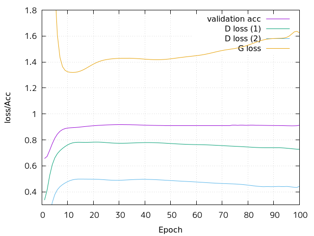
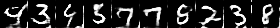
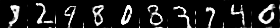
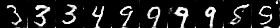

# GAN for semi-supervised learning

## Architecture

```
Generator: noise -> FakeImage
Classifier/Discriminator: RealImage -> Class, True
Classifier/Discriminator: FakeImage -> False
```

## ref

- [[1606.03498] Improved Techniques for Training GANs](https://arxiv.org/abs/1606.03498)
- [Improved Techniques for Training GANs [arXiv:1606.03498] – ご注文は機械学習ですか？](https://musyoku.github.io/2016/12/23/Improved-Techniques-for-Training-GANs/)

## Result

Learning with only 100 labeled examples.



### Generated

10 epoch:


50 epoch:


99 epoch:

